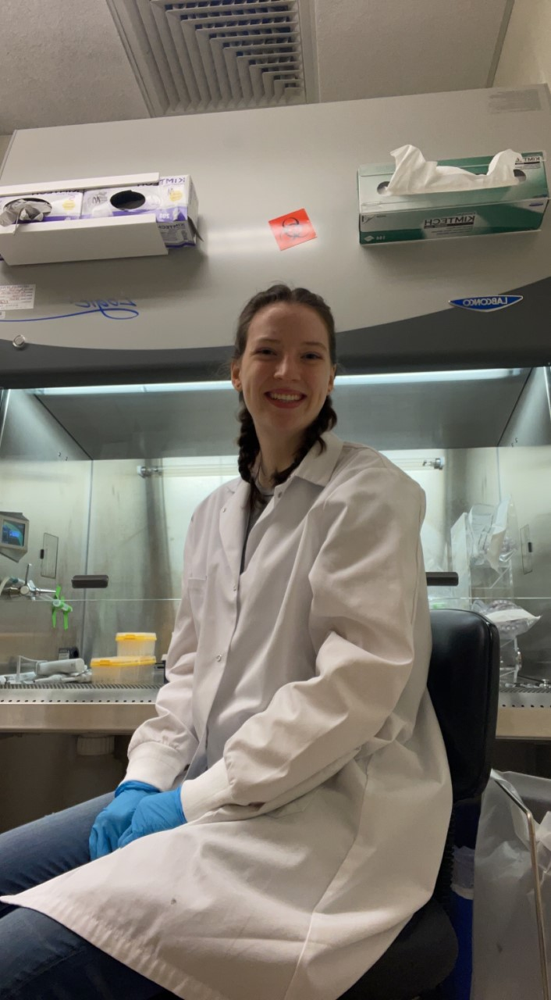

My name is Evie Proctor. I am a 1st year PhD student in Biochemistry at UNH, however I'm not new to UNH at all! I did my Bachelor's and Master's degree here as well.

I work with Merkel Cell Carcinoma, a rare neuroendocrine skin cancer with the highest mortality rate of known skin cancers. I specifically look into DNA damage response pathways and am starting to look into chromatin remodelers!

In my free time (if I ever had any of that) I like to read, go on hikes, and play card games with friends. I also spend a lot of time snuggling my cat Pepper!

